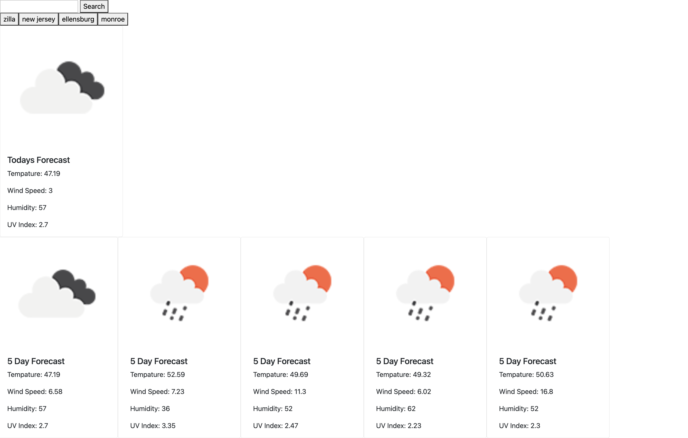

# ChanceofRainorJustCloudy
A display of pnw based weather. 

Repo Link: https://github.com/charliem61/ChanceofRainorJustCloudy

Live Url: 

Goal/Motivation:

    
    When the user approaches the enters the site, they are prompted with a search bar where they can search most cities in the world. Once a city is entered, data is pulled from the weather api to show that city's daily weather and a 5 day forecast for that city.

Problems Solved:
 
    Any city entered has the ability to show the 5 day and daily weather for that day. That city is also stored in local storage for the use to click on that city if desired in the future.

The Standout:

    I like that it has an image for the weather that the data is displaying for that city and time frame of that weather. 
    

Challenges Faced:

    My challenge was getting the console log to store the city. Then pull the 5 day display and then to display that in a inline format of the 5 day forecast. 

